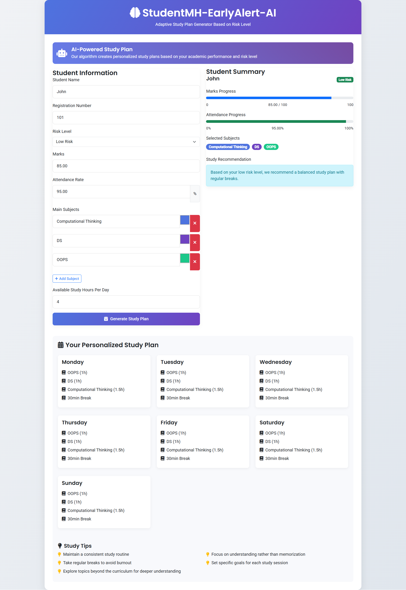

# 🎓 Student Mental Health Early Detection AI  

[]()  []()  []() 
[]()  

---

## 📖 Overview  

**StudentMH-EarlyDetect-AI** is an **AI-powered system** that predicts student mental health risk levels using **academic performance** and **behavioral data** (focus on **attendance percentage**).  

It leverages a **Machine Learning pipeline** with **Random Forest classification** to accurately detect **Low, Moderate, and High-risk students** and generates **personalized AI-powered study plans** to improve academic performance.  

✨ The platform includes **three login portals**:  
- 👩‍🎓 **Student** → View progress & AI study planner  
- 👨‍🏫 **Staff** → Track students & get high-risk alerts  
- 👩‍💼 **Admin** → Manage data & analytics  

---

## 🎯 Project Objectives  

✔️ Early detection of **mental health issues** through data analysis  
✔️ Identify **at-risk students** for academic failure  
✔️ Break the cycle of **pressure → poor performance → increased pressure**  
✔️ Provide **AI-generated study plans** for students  
✔️ Enable **staff alerts** for high-risk students  

---

## 🛠️ Technical Architecture  

### 🔹 System Components  
- **Machine Learning Pipeline**  
  - 🧩 `SimpleImputer`: Handles missing values  
  - 🚫 `IsolationForest`: Detects anomalies  
  - 🤖 `RandomForestClassifier`: Classifies into **Low / Moderate / High risk**  
  - 📊 Synthetic Data Generation: Creates training data with clear risk patterns

- **Database**: MySQL (student data + predictions)  
- **Backend**: PHP (server-side processing + DB interaction)  
- **Frontend**: HTML, CSS, JavaScript, Bootstrap (3-tier portals)  

---

## 💻 Technology Stack  

### 🛠️ Development Stack
| Layer | Technologies |
|:------|:------------|
| **Frontend** |     |
| **Backend** |  |
| **Database** |  |

### 🤖 Machine Learning Stack
| Component | Technologies |
|:----------|:------------|
| **Language** |  |
| **ML Framework** |  |
| **ML Models** |    |

--- 
## 👥 User Roles & Features  

### 👩‍🎓 **Student Login**  
- View personal details & academic performance  
- Access **AI-generated study planner** 📅  
- Monitor personal **risk level** & progress 




### 👨‍🏫 **Staff Login**  
- View **student details & performance**  
- See **accurate risk predictions** (Low / Moderate / High)  
- Get **alerts for high-risk students** 🚨   


### 👩‍💼 **Admin Login**  
- Full **system-wide view** of data & performance  


---

## 🔮 Future Enhancements  

- Enhancing a more **adaptable AI-based study planner**  
- Integration of **additional data sources**   
- Advanced ML models (**Neural Networks, Gradient Boosting**)  
- Real-time **notifications** for urgent risk cases  
- Integration with **counseling services** 🧑‍⚕️  
- **NLP** for analyzing student feedback  

---

## ⚙️ Installation & Setup  

Follow these steps to set up the project on your local machine:  

1️⃣ **Fork or Download the Repository**  
   - Place the project folder inside your `xampp/htdocs/` directory.  

2️⃣ **Start XAMPP Control Panel**  
   - Run **Apache** and **MySQL** services.  

3️⃣ **Create the Database**  
   - Open **phpMyAdmin** or MySQL and create a new database.  
   - Inside this database, create the **Admin table** using the following query:  

   ```sql
   CREATE TABLE admin (
       id INT AUTO_INCREMENT PRIMARY KEY,
       admin_name VARCHAR(100) NOT NULL,
       email VARCHAR(100) NOT NULL UNIQUE,
       password VARCHAR(255) NOT NULL
   );
   ```

  - Insert at least one admin record (you can modify values as needed):
```
INSERT INTO admin (admin_name, email, password) 
VALUES ('System Admin', 'admin@gmail.com', 'admin123');
```


⚠️ Note: Update the database name in your project files.

4️⃣ **Prepare Student & Staff Data (Excel)**  
   - Before running the Python script, create and store the data in Excel format.  
   - **Student Data (student_data.xlsx)** must have the following columns:  
     - `student_name`, `reg_no`, `staff_name`, `marks`, `attendance`, `gmail`, `password`  
   - **Staff Data (staff_data.xlsx)** must have the following columns:  
     - `staff_name`, `email`, `password`, `department`  

   📌 *Refer to the provided files* → `student_data.xlsx` and `staff_data.xlsx` for the correct format.  


 5️⃣ Run the Machine Learning Script

This will read student & staff Excel data, process it, and store results in the database.
```
python main.py
```
6️⃣ Run the PHP Application

- Open your browser and navigate to the project folder inside `htdocs`.
```
http://localhost/StudentMH-EarlyDetect-AI/login.php

```

- Use the Admin / Staff / Student login credentials to access the system.

---


## 🤝 Contributing  

Collaboration makes everything better 🌟  
- Found a bug? 🐞 Fix it or open an issue!  
- Got an idea? 💡 Share it! 
- Want to improve? ✨ Go for it!  

Fork → Code → PR = 🎉  

   